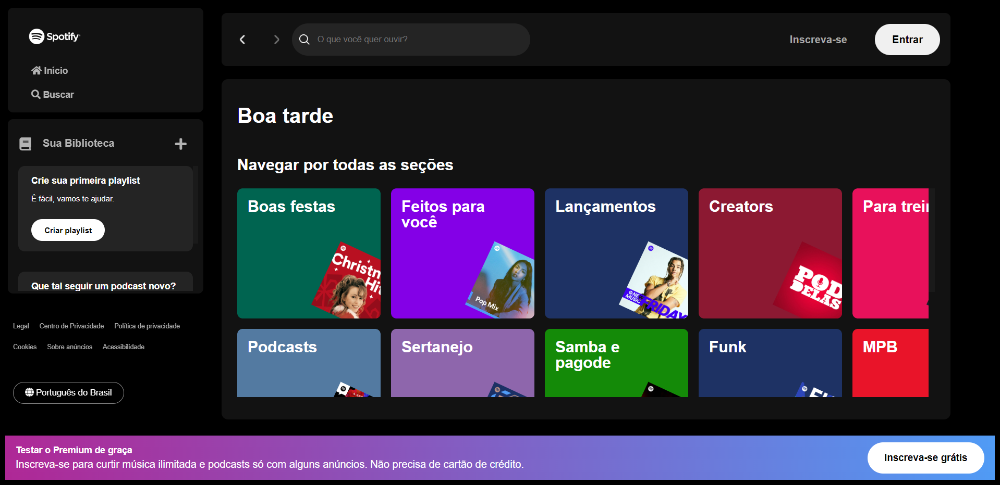

# Página inicial do Spotify - Clone

| Clone                                      | Original                                   |
| ------------------------------------------ | ------------------------------------------ |
| [Spotify - Clone](https://uber-sleep.github.io/spotify-clone-alura/) | [Spotify - Original](https://open.spotify.com/intl-pt) |

## Objetivos

Este projeto, clone da página inicial do Spotify, foi desenvolvido durante a Imersão Front-End Alura. O foco principal foi seguir as instruções durante as aulas para implementar uma pesquisa dinâmica na interface. Participar do evento não só permitiu a aplicação prática de habilidades em HTML, CSS e JavaScript, mas também a exploração de conceitos avançados, incluindo a manipulação de APIs. Essa imersão prática foi significativa para consolidar meus conhecimentos e iniciar o desenvolvimento de novas habilidades no campo do front-end.

## Desafios
Durante a execução deste projeto, enfrentei desafios que se revelaram fundamentais para meu aprendizado. A criação inicial de uma API fictícia apresentou alguma confusão devido à minha falta de familiaridade prévia, especialmente na manutenção operacional após a publicação do projeto. Contudo, resolvi esse desafio por meio da consulta a tutoriais e documentação online.

Enquanto seguia as instruções para exibir dados na tela, me deparei com um problema relacionado a um dos critérios da API demonstrados em aula. Para superar isso, optei por uma abordagem adaptativa, aplicando meus conhecimentos em lógica.

Essas experiências não apenas resolveram desafios imediatos, mas também refinaram minha capacidade de resolução de problemas e improvisação, contribuindo significativamente para o meu desenvolvimento.

## Funcionalidades

### Cumprimento Dinâmico
O sistema apresenta um cumprimento dinâmico com base no horário do dia, desejando "Bom dia", "Boa tarde" ou "Boa noite" ao usuário.

### Pesquisa e Visualização de Artistas
Os usuários podem realizar pesquisas de artistas usando a barra de pesquisa. A aplicação realiza consultas na API fictícia do Spotify e exibe os resultados de forma dinâmica, apresentando o nome do artista e uma imagem representativa.

### Utilização de Dados Fictícios
A aplicação utiliza uma API fictícia do Spotify com dados pré-determinados para simular interações realistas com a plataforma.

## Tecnologias Utilizadas
- HTML5: Utilizado para a estruturação e marcação do conteúdo.
- CSS3: Responsável pela estilização e apresentação visual da aplicação.
- JavaScript: Utilizado para a lógica de programação, interação com o usuário e integração com a API fictícia do Spotify.

## Navegação

### Busca de Artistas

- Utilize a barra de pesquisa localizada no topo da página para inserir o nome do artista que deseja encontrar. À medida que digita na barra de pesquisa, os resultados serão atualizados automaticamente.
- Caso a barra de pesquisa esteja vazia, a seção de resultados exibirá playlists sugeridas.
- Após inserir um termo de pesquisa, a seção de resultados será alterada para exibir informações sobre o(s) artista(s) correspondente(s).

### Saudação Personalizada

A saudação na página inicial muda dinamicamente com base no horário do dia:
- "Bom dia" das 6h às 12h.
- "Boa tarde" das 12h às 18h.
- "Boa noite" das 18h às 6h.

## Estrutura do Código

O código-fonte deste projeto está organizado de maneira clara e eficiente para garantir uma experiência de desenvolvimento e manutenção facilitada. Abaixo, destaco as principais características da estrutura:

### Saudação Condicional
  - Utilização de estruturas condicionais para criar uma saudação dinâmica, que se ajusta ao horário do dia.

### Manipulação da Barra de Pesquisa
   - Uso de eventos de input para atualizar os resultados conforme o usuário digita na barra de pesquisa.

### Chamada à API Falsa do Spotify
   - Utilização da Fetch API para obter dados da API fictícia do Spotify, facilitando a obtenção de informações sobre artistas.

### Exibição de Resultados
   - Estrutura de exibição flexível, alternando entre playlists sugeridas e detalhes do artista.

### Tratamento de Erros
   - Implementação de um bloco try/catch para lidar com possíveis erros durante a chamada à API.

### Funções Assíncronas
   - Uso de funções assíncronas para otimizar operações, como a busca na API.

## Melhorias Futuras

Apesar de atingir os objetivos iniciais, o planejo fazer algumas melhorias para aprimorar a experiência do usuário e otimizar o código. As principais melhorias incluem:

### Responsividade:
   - Implementação de um design responsivo para garantir que a aplicação seja agradável e funcional em diferentes dispositivos.

### Aprimoramentos de Acessibilidade:
   - Introdução de práticas e elementos que promovam uma experiência mais inclusiva, atendendo às diretrizes de acessibilidade, tornando a aplicação mais amigável para usuários com diferentes necessidades.

### Otimizações de Código:
   - Revisão e aprimoramento do código-fonte para garantir maior legibilidade, eficiência e aderência às melhores práticas de desenvolvimento, facilitando a manutenção futura.

Essas melhorias refletem meu compromisso contínuo com a qualidade e a usabilidade do projeto. Agradeço por qualquer feedback e sugestões, pois eles desempenham um papel crucial na evolução constante desta aplicação.

